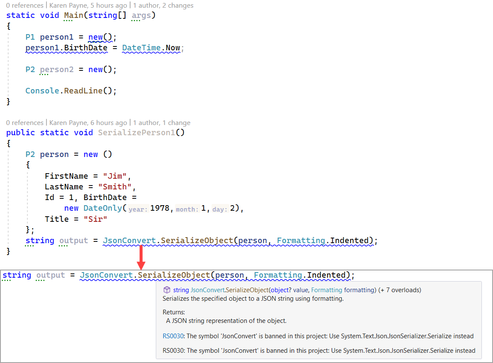

#  Microsoft.CodeAnalysis.BannedApiAnalyzers

To use see [how to use](https://github.com/dotnet/roslyn-analyzers/blob/main/src/Microsoft.CodeAnalysis.BannedApiAnalyzers/BannedApiAnalyzers.Help.md)

Example BannedSymbols.txt file

```
P:System.DateTime.Now;Use System.DateTime.UtcNow instead
T:Library1.Models.Person;Use Library2.Models.Person which uses DateOnly rather than DateTime.
T:Newtonsoft.Json.JsonConvert;Use System.Text.Json.JsonSerializer instead
```

## Application1 project

Points to a file outside of the project.
```xml
<ItemGroup>
    <AdditionalFiles Include="C:\\OED\\DotnetLand\\Banned\\BannedSymbols.txt" />
</ItemGroup>
```

Also, code in referenced project Library1 has aliases

```xml
<ItemGroup>
    <ProjectReference Include="..\Library1\Library1.csproj" />
    <ProjectReference Include="..\Library2\Library2.csproj" />
</ItemGroup>

<ItemGroup>
    <Using Include="Library1.Models.Person" Alias="P1" />
    <Using Include="Library2.Models.Person" Alias="P2" />
</ItemGroup>
```

## Library1 project

Points to a file in the project root folder.

```xml
<ItemGroup>
	<AdditionalFiles Include="BannedSymbols.txt" />
</ItemGroup>
```

### Example

From Application1



## Banned files

Since the project Application1 links to a folder that you don't have Visual Studio may remove the entry in the project file, if so there are copies under the root of this solution in the folder Configurations.